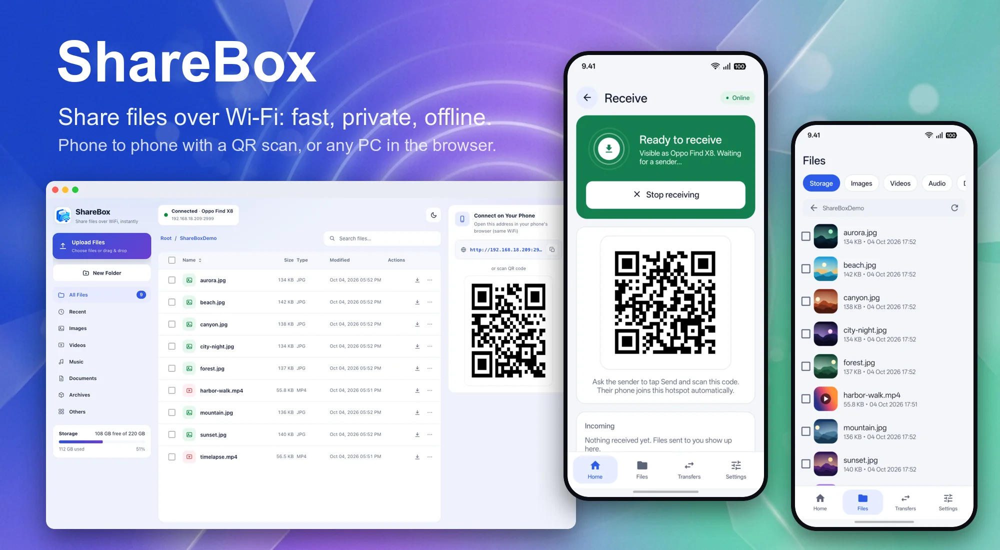
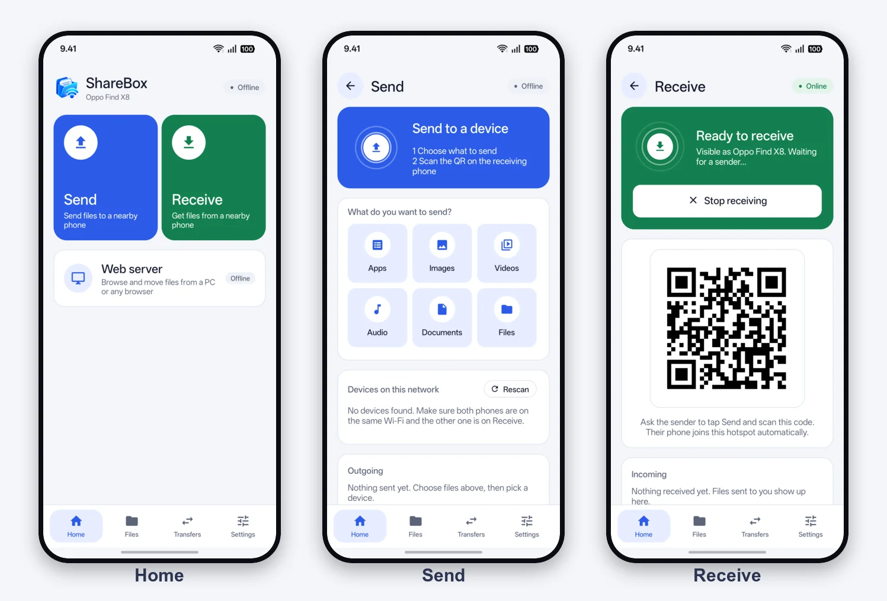
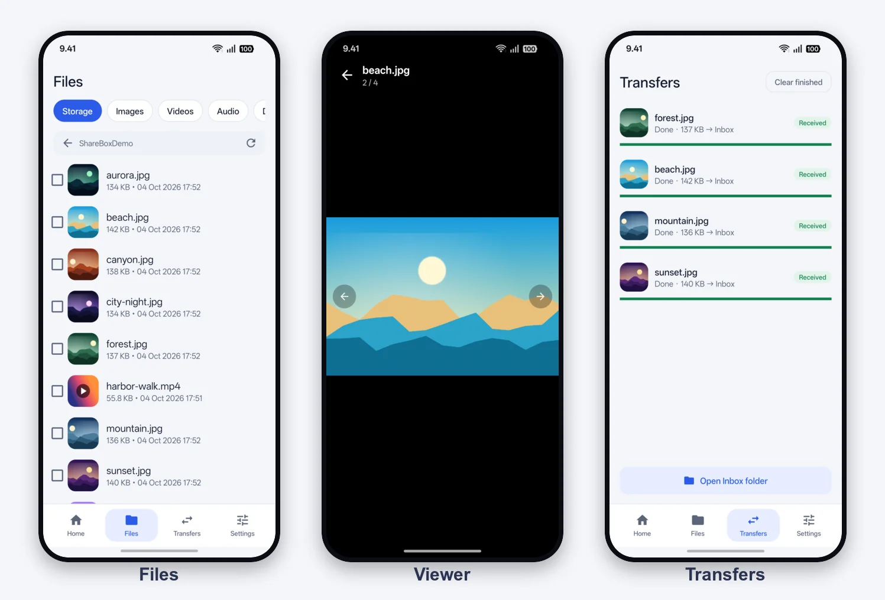
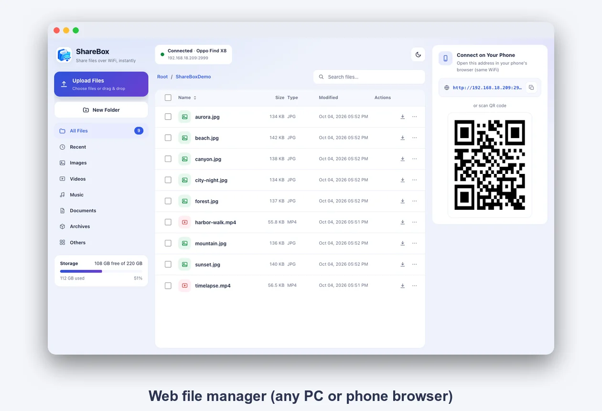

<p align="center">
  
</p>

<h1 align="center">ShareBox</h1>

<p align="center">
  Share files over Wi-Fi: phone to phone with a QR scan, or any PC through the browser.<br>
  Tiny, ad-free, no account, no internet needed.
</p>

<p align="center">
  <a href="https://github.com/ahmadarif-lab/sharebox/releases/latest"></a>
  
  
  
</p>

<p align="center">
  
</p>

## Why ShareBox

Moving a few gigabytes between two phones, or a phone and a PC, should not need a cable, an
account or a cloud. ShareBox keeps everything on your local network: the phone *is* the server,
and the whole app is about 220 KB, built on the plain Android framework with a single dependency
(zxing, for QR codes).

## Features

**Phone to phone: Send and Receive**

- **Receive** turns on a local-only hotspot and shows a QR code.
- **Send**: choose files (apps, images, videos, audio, documents, anything), then scan that QR.
  The sender joins the hotspot by itself and sends directly. No pairing screen, no typing a password.
- On a shared Wi-Fi the QR carries the LAN address instead, and devices on the same network can
  also be picked from a list (they need an Approve tap on the receiver).
- Installed apps can be sent as APKs; tapping a received `.apk` opens the system installer.

**Web server: any PC or phone browser**

- A full web file manager on the phone: browse, download, upload (drag and drop), rename,
  delete, new folder, zip a folder, search, categories.
- Preview images, video, audio and PDF, with seeking and zoom. Light and dark theme.
- Runs on its own and is separate from the phone-to-phone transfer.

**In the app**

- Thumbnails for images and videos, and a built-in viewer: pinch to zoom, swipe between photos,
  play video, no other app needed.
- Live transfer list with direction (sent or received), speed and progress.
- Foreground service with a Wi-Fi lock, so long transfers survive a locked screen.
- Light, dark or follow-the-system theme.

## Screenshots

<p align="center">
  
</p>
<p align="center">
  
</p>
<p align="center">
  
</p>

## Install

Download the APK from the [latest release](https://github.com/ahmadarif-lab/sharebox/releases/latest)
and open it (Android will ask you to allow installing from that source once). It also has a page at
<https://apps.bontot.my.id/sharebox/>.

The release is signed with the author's own key; compare the SHA-256 listed in the release notes
with `shasum -a 256 <file>` if you want to be sure.

## Build

```sh
./gradlew :app:assembleRelease
# APK: app/build/outputs/apk/release/app-release.apk
```

Needs JDK 17 and the Android SDK (`compileSdk 36`). Release builds are minified and resource-shrunk.

**Signing.** The release key is not in this repository. Without it the build signs with the debug
key, which is fine for trying it out. To sign your own release, create `key.properties` next to
`gradlew` (it is git-ignored):

```properties
storeFile=/absolute/path/to/your.jks
storePassword=...
keyAlias=...
keyPassword=...
```

## How it works

| Piece | Details |
|---|---|
| Web server | HTTP on port `2999`, fixed. Streams files with Range support. No authentication: use it on networks you trust. |
| Phone to phone | Its own TCP protocol (SBX1) on port `47778`, open only while **Receive** is on. |
| Discovery | UDP broadcast on port `47777`, used by "Devices on this network". It finds devices on the same network, not physically near ones. |
| Storage | App folder only, or all files with the "All files access" permission. Received files go to `Inbox`. |

### Direct protocol (SBX1)

Framed TCP: a 4-byte magic `SBX1`, JSON frames (`writeUTF`) and raw file bytes.

```
C → S  MAGIC, {"id","name","key"?,"token"?}
S → C  {"ok":true,"token","name"} | {"ok":false,"error":"declined"|"timeout"}
C → S  {"name","size"} + <size bytes>        (repeated per file)
S → C  {"ok":true,"name":<saved name>}
C → S  {"end":true}
```

The receiver's QR is `sharebox://join?id=&n=&h=<host>&p=<port>&k=<session key>[&s=<ssid>&w=<pass>]`.
A sender that presents the session key (visible only on the receiver's screen) is accepted without
a prompt. Anyone else needs an Approve tap on the receiver.

### Web API

| Endpoint | Description |
|---|---|
| `GET /` | Web file manager UI |
| `GET /api/list?path=` | JSON directory listing |
| `GET /api/find?cat=&q=&limit=` | Search and category scan |
| `GET /api/download?path=[&inline=1]` | Stream a file (Range supported) |
| `GET /api/zip?path=` | Stream a folder as zip |
| `PUT /api/upload?path=&name=` | Raw-body upload |
| `POST /api/mkdir`, `rename`, `delete` | File management |
| `POST /api/pause`, `resume`, `cancel` | Control a running transfer by id |
| `GET /api/progress` | Live transfers |
| `GET /api/qr?text=&size=` | PNG QR code |
| `GET /api/info` | Device and storage info |

## Notes

- The HTTP server has no authentication: anyone on the same network can browse and write.
- Android 15+ may stop the `dataSync` foreground service after about 6 hours.
- Apps built as bundles (split APKs) are sent as their base APK only, which may not install alone.

## License

MIT, see [LICENSE](LICENSE).
